#  ProjectBackendIAGI - Plateforme de Recrutement

<p align="center">
  
</p>

## Présentation du Projet
Ce projet est une API Backend développée avec **Laravel 11** pour la gestion d'offres d'emploi. Cette première phase concerne la modélisation des données et l'initialisation de l'environnement de développement.

---

##  Partie 1 : Modélisation et Base de Données

L'objectif de cette étape était de construire une base de données solide et fonctionnelle, prête à accueillir l'authentification et les fonctionnalités métier.

### Structure de la Base de Données
J'ai creer le repetoire ProjectLaravelIAGI </br>
 </br>


J'ai implémenté les migrations pour les entités suivantes, conformément au MLD :
- **Users** : Gestion des rôles (admin, recruteur, candidat).
- **Profils** : Détails des candidats (titre, bio, localisation, disponibilité).
- **Offres** : Annonces postées par les recruteurs (CDI, CDD, Stage).
- **Compétences** : Liste technique (Backend, Frontend, Design, etc.).
- **Candidatures** : Lien entre un candidat et une offre avec gestion de statut.
- **Profil_Competence** : Table pivot pour la relation Many-to-Many entre profils et compétences.

### Seeding & Données de Test
La base est automatiquement pré-remplie avec les données suivantes :
- **2 Administrateurs**.
- **5 Recruteurs** (avec 2 à 3 offres chacun).
- **10 Candidats** (avec profil complet et compétences associées).

---

## Installation et Utilisation

Pour lancer le projet localement et vérifier la structure :

1. **Clonage du dépôt** :
   ```bash
   git clone [https://github.com/bdarid/ProjectBackendIAGI.git](https://github.com/bdarid/ProjectBackendIAGI.git)
   cd ProjectBackendIAGI


</br>

2. **Installation des dépendances :** :  
   Afin d'ignorer les contraintes de version si PHP < 8.4
   
   </br>

3. **Creation de la branche de Travail** :  
   
   </br>

4. **Table User** :  
   Modification dans database > migrations </br>
   
   </br>


5. **Créer les nouveaux modèles migrations et préparer les Factories** :  
   </br>
   

</br>


6. **Configurer DatabaseSeeder** :  </br>
   Dans database/seeders/DatabaseSeeder.php </br>
   
   </br>


7. **Modifier les modèles** : </br>
   On modifier les modeles Offres, Profil, Competence et Candidature dans app/Models </br>
   
   </br>


</br>


</br>


</br>


8. **Générer des données pour la table profils** :  </br>
   Dans le dossier database/factories/ </br>
   
   </br>


9. **Générer les offres d'emploi (CDI, CDD, stage)** :  
   
   </br>


10. **Pour la table competences** :  
    
    </br>


11. **Code de la migration offre** :  </br>
    Dans database/migrations/2026_04_13_195513_create_offres_table.php </br>
    
    </br>


12. **Migration profile** :  
    
    </br>

13. **Migration candidatures** :  
    
    </br>

14. **Database seeding** :  
    
    </br>

---

## Partie 2 & 3 : Authentification JWT & Endpoints API 

Cette phase concerne la sécurisation de l'API avec **JWT** et la mise en place des routes **(CRUD)** pour les profils, les offres et les candidatures, avec une gestion stricte des rôles via **Middleware**.

---

### Tests et Validation sur Postman

L'API a été testée et validée avec succès. Voici les preuves de fonctionnement de nos endpoints clés :

---

### 1. Inscription (Register)

**Création d'un nouveau compte candidat avec succès (201 Created) :**  
.png)
</br>

**Validation des données — Paramètres manquants ou invalides (Erreur 422) :**  
.png)
</br>

---

### 2. Connexion (Login)

**Authentification réussie et récupération du Token JWT (200 OK) :**  
.png)
</br>

**Token absent ou invalide — Accès refusé (Erreur 401 Unauthorized) :**  
.png)
</br>

---

### 3. Consultation du Profil Candidat

**Accès protégé aux informations du profil via le Token JWT :**  

</br>

---

### 4. Modification du Profil

**Un candidat met à jour ses informations personnelles (titre, bio, localisation) :**  

</br>

---

### 5. Sécurité des Rôles — Le Mur 403 Forbidden

**Tentative bloquée : un candidat essaie de créer une offre d'emploi (action réservée aux recruteurs) :**  

</br>

**Tentative bloquée : un candidat essaie de modifier le statut d'une candidature (action réservée aux recruteurs) :**  

</br>

---

### 6. Création d'une Offre d'Emploi

**Un recruteur authentifié crée une nouvelle offre d'emploi avec succès (201 Created) :**  
.png)
</br>

---

### 7. Gestion des Candidatures

**Un candidat postule à une offre spécifique avec succès :**  
.png)
</br>

---

## Partie 4 : Événements et Listeners (Events & Listeners)

Pour garder une trace des actions importantes dans le système, comme l'envoi d'une candidature ou la modification de son statut, j'ai mis en place des événements (Events) couplés à des écouteurs (Listeners). 

### 1. Enregistrement dans le Provider
Toutes les correspondances entre événements et écouteurs sont déclarées dans `AppServiceProvider` :  
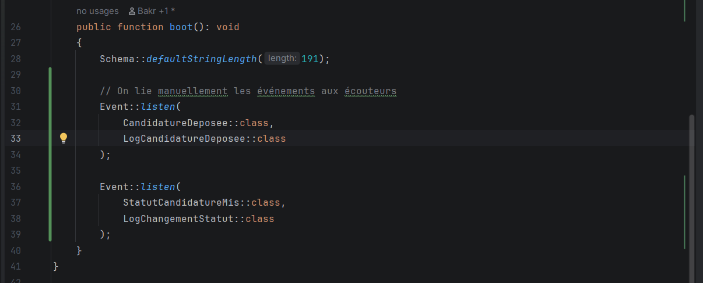
</br>

### 2. Dépôt de candidature
Lorsqu'un candidat postule à une offre, l'événement `CandidatureDeposee` est déclenché. Le listener `LogCandidatureDeposee` s'occupe de réagir à cette action par un log.

**L'événement (`CandidatureDeposee`) :**  
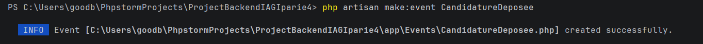  
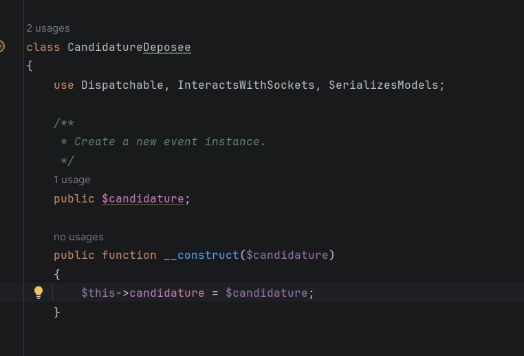
</br>

**Le Listener (`LogCandidatureDeposee`) :**  
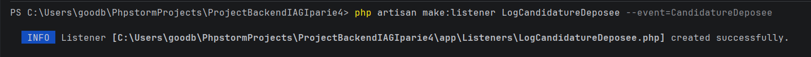  
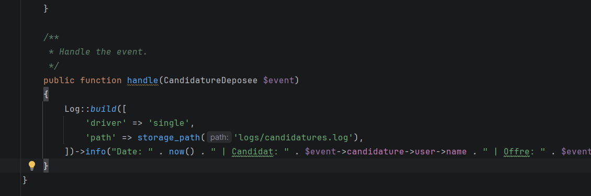
</br>

### 3. Modification du statut d'une candidature
Lorsqu'un recruteur change le statut d'une candidature (acceptée, rejetée, etc.), l'événement `StatutCandidatureMis` entre en jeu, écouté par `LogChangementStatut`.

**L'événement (`StatutCandidatureMis`) :**  
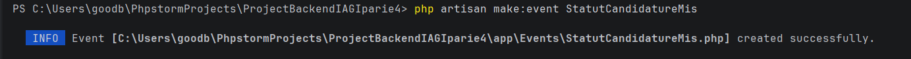  
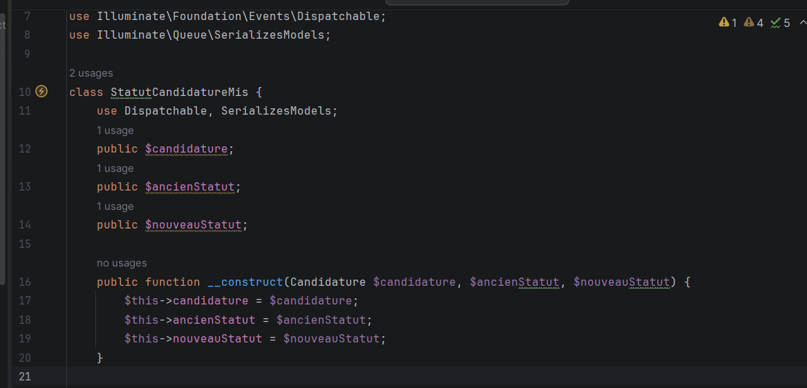
</br>

**Le Listener (`LogChangementStatut`) :**  
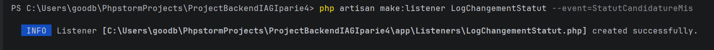  
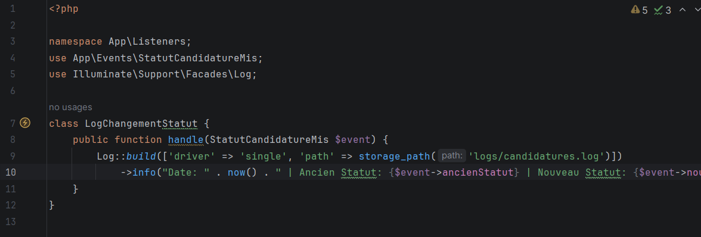
</br>


## Partie 5 : Collection Postman & Scénarios de Test

Conformément aux exigences du projet, une collection Postman complète a été exportée et déposée dans le dépôt GitHub. Vous trouverez le fichier `.json` contenant tous les tests dans le dossier `postman/` à la racine du projet. 

### Emplacement de la Collection
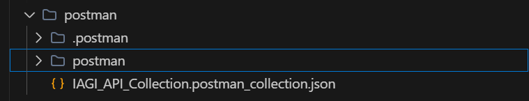
</br>
### Scénarios Couverts par la Collection

Cette collection couvre l'intégralité des scénarios d'utilisation de l'API, structurée pour valider les chemins nominaux ainsi que la gestion des erreurs :
</br>
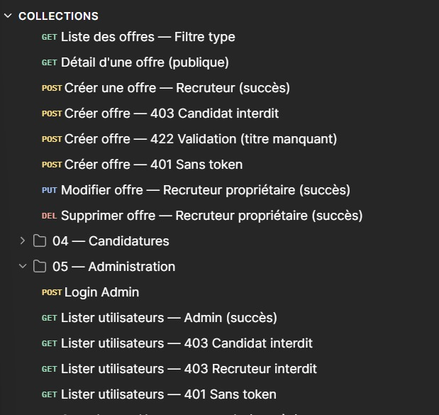
</br>

**1. Authentification**
- Scénarios d'inscription et de connexion pour la récupération du Token JWT.

**2. Opérations CRUD (Profils et Offres)**
- Scénarios complets pour la gestion des profils par les candidats.
- Scénarios complets pour la gestion des offres d'emploi par les recruteurs.

**3. Candidatures & Changement de Statut**
- Dépôt d'une candidature à une offre par un candidat.
- Mise à jour du statut de la candidature par un recruteur.

**4. Gestion des Erreurs (401, 403, 422)**
Afin de garantir la robustesse de l'API, des requêtes spécifiques valident les rejets du serveur :
- **Erreur 401 (Non autorisé)** : Requêtes effectuées sans Token JWT valide.
- **Erreur 403 (Interdit)** : Tentatives d'accès à des actions non autorisées par le rôle (ex: un candidat qui tente de créer une offre ou de modifier un statut).
- **Erreur 422 (Entité non traitable)** : Soumission de requêtes avec des données manquantes ou invalides.

---

## Partie 4 : Événements et Listeners (Events & Listeners)

Pour garder une trace des actions importantes dans le système, comme l'envoi d'une candidature ou la modification de son statut, j'ai mis en place des événements (Events) couplés à des écouteurs (Listeners). 

### 1. Enregistrement dans le Provider
Toutes les correspondances entre événements et écouteurs sont déclarées dans `AppServiceProvider` :  

</br>

### 2. Dépôt de candidature
Lorsqu'un candidat postule à une offre, l'événement `CandidatureDeposee` est déclenché. Le listener `LogCandidatureDeposee` s'occupe de réagir à cette action par un log.

**L'événement (`CandidatureDeposee`) :**  
  

</br>

**Le Listener (`LogCandidatureDeposee`) :**  
  

</br>

### 3. Modification du statut d'une candidature
Lorsqu'un recruteur change le statut d'une candidature (acceptée, rejetée, etc.), l'événement `StatutCandidatureMis` entre en jeu, écouté par `LogChangementStatut`.

**L'événement (`StatutCandidatureMis`) :**  
  

</br>

**Le Listener (`LogChangementStatut`) :**  
  

</br>


## Partie 5 : Collection Postman & Scénarios de Test

Conformément aux exigences du projet, une collection Postman complète a été exportée et déposée dans le dépôt GitHub. Vous trouverez le fichier `.json` contenant tous les tests dans le dossier `postman/` à la racine du projet. 

### Emplacement de la Collection

</br>
### Scénarios Couverts par la Collection

Cette collection couvre l'intégralité des scénarios d'utilisation de l'API, structurée pour valider les chemins nominaux ainsi que la gestion des erreurs :
</br>

</br>

**1. Authentification**
- Scénarios d'inscription et de connexion pour la récupération du Token JWT.

**2. Opérations CRUD (Profils et Offres)**
- Scénarios complets pour la gestion des profils par les candidats.
- Scénarios complets pour la gestion des offres d'emploi par les recruteurs.

**3. Candidatures & Changement de Statut**
- Dépôt d'une candidature à une offre par un candidat.
- Mise à jour du statut de la candidature par un recruteur.

**4. Gestion des Erreurs (401, 403, 422)**
Afin de garantir la robustesse de l'API, des requêtes spécifiques valident les rejets du serveur :
- **Erreur 401 (Non autorisé)** : Requêtes effectuées sans Token JWT valide.
- **Erreur 403 (Interdit)** : Tentatives d'accès à des actions non autorisées par le rôle (ex: un candidat qui tente de créer une offre ou de modifier un statut).
- **Erreur 422 (Entité non traitable)** : Soumission de requêtes avec des données manquantes ou invalides.